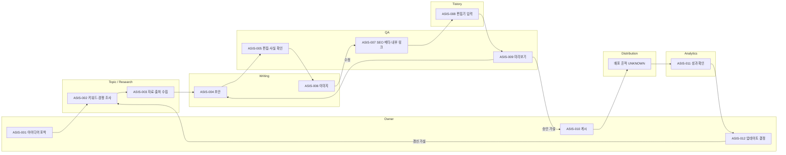

# 01. AS-IS 프로세스 복원 초안

## 증거 상태

이 문서는 **확정된 현재 운영 절차가 아니다**. 소유자는 `https://nedamma.tistory.com`을 제공했고, 2026-09-07 공개 사이트맵에서 63개 entry URL과 6개 명명 카테고리를 확인했다. 63개 URL은 모두 HTTP 200이었으며 공개 글의 관측 게시 범위는 2019-12-12부터 2020-02-10까지다. 그러나 관리자 화면, 비공개 분석 로그, 과거 작업 메모와 실제 작업 방식은 확인되지 않았다. 따라서 공개 자산 존재는 확인된 사실이지만 아래 운영 블록은 여전히 인터뷰로 검증할 **낮은 신뢰도의 가설**이다. 숫자형 시간·빈도·결함률은 0이 아니라 `unknown`이다. 상세 근거는 [`09_public_asset_audit.md`](09_public_asset_audit.md)에 있다.

## 프로세스 블록

각 블록의 실행 가능한 원본은 [`contracts/process-traceability.json`](../contracts/process-traceability.json)에 있다. 모든 블록은 요구된 `process_id`, `name`, `actor`, `trigger`, `inputs`, `action`, `outputs`, `system_or_tool`, `touch_time`, `wait_time`, `frequency`, `defect_or_rework_rate`, `handoffs`, `evidence`, `confidence` 필드를 가진다.

| ID | 이름 | actor | trigger | inputs → action → outputs | system/tool | 시간·빈도·결함 | handoffs | evidence | confidence |
|---|---|---|---|---|---|---|---|---|---|
| ASIS-001 | 아이디어 포착 | Owner | 독자 질문/소재 | 메모 → 후보 기록 가설 → 미구조화 후보 | UNKNOWN | 모두 unknown | Topic/Research | 장기 휴면 진술, CL-008 | low |
| ASIS-002 | 키워드·경쟁 조사 | Topic/Research | 후보 선택 | 후보 → 수요·경쟁 확인 가설 → 선택 주제 | UNKNOWN | 모두 unknown | Topic/Research | 직접 증거 없음 | low |
| ASIS-003 | 자료·출처 수집 | Topic/Research | 주제 확정 | 주제 → 자료 수집 가설 → 참고 자료 | UNKNOWN | 모두 unknown | Writing | source ledger 없음 | low |
| ASIS-004 | 초안 작성 | Writing | 자료 준비 | 주제·자료 → 작성 가설 → 초안 | UNKNOWN | 모두 unknown | QA | 과거 게시 경험 진술 | low |
| ASIS-005 | 편집·사실 확인 | QA | 초안 완료 | 초안·자료 → 검토 가설 → 편집본 | UNKNOWN | 모두 unknown | Writing/Tistory | QA 기록 없음 | low |
| ASIS-006 | 이미지 준비 | Writing | 편집본 준비 | 이미지 후보 → 준비 가설 → 이미지·alt 후보 | UNKNOWN | 모두 unknown | Tistory | 공개 표본에 이미지 존재; 제작·권리 절차는 unknown | low |
| ASIS-007 | SEO 메타·내부 링크 | QA | 편집본 준비 | 편집본·과거 글 → 메타 결정 가설 → 제목·태그·링크 | UNKNOWN | 모두 unknown | Tistory | 63개 공개 URL·canonical 확인; 선택 절차는 unknown | low |
| ASIS-008 | 티스토리 입력 | Tistory | 패키지 준비 | 본문·미디어·메타 → 편집기 입력 가설 → 편집기 초안 | Tistory editor | 모두 unknown | QA | CL-001, CL-002 | low |
| ASIS-009 | 미리보기 확인 | QA | 편집기 초안 | 초안 → 시각 확인 가설 → 승인/수정 | Tistory preview | 모두 unknown | Writing/Tistory | preview 로그 없음 | low |
| ASIS-010 | 게시 | Owner | 미리보기 승인 | 승인 초안 → 공개 선택 가설 → 공개 URL | Tistory editor | 모두 unknown | Distribution/Analytics | 현재 권한 미확인 | low |
| ASIS-011 | 성과 확인 | Analytics | 게시 후 | URL·지표 → 성과 확인 가설 → 관찰 | UNKNOWN | 모두 unknown | Owner | CL-007, CL-011 | low |
| ASIS-012 | 업데이트 여부 | Owner | 성과/노후화 인지 | 관찰·주장 → 유지/갱신/통합 판단 가설 → 후보 | UNKNOWN | 모두 unknown | Research/Writing | 갱신 로그 없음 | low |

## 검증 계획

공개 URL/status baseline과 63개 글의 metadata-only intent·freshness·risk triage를 확보했다. 내부/외부 링크 상태와 미디어 provenance는 아직 `not_audited`/`unknown`이며, 과거 문체는 학습하거나 미래 전략의 제약으로 사용하지 않는다. 소유자 인터뷰에서는 각 블록의 실제 존재 여부와 사용 도구, 10개 표본의 touch/wait time, 수정 왕복과 결함을 확인한다. 비공개 분석 접근은 별도 범위 확인 후에만 연결한다. 증거와 모순되는 블록은 삭제하거나 분할하며, AS-IS를 TO-BE의 정당화용 허구로 소급 작성하지 않는다.
