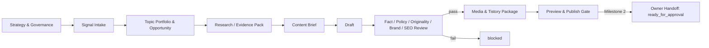
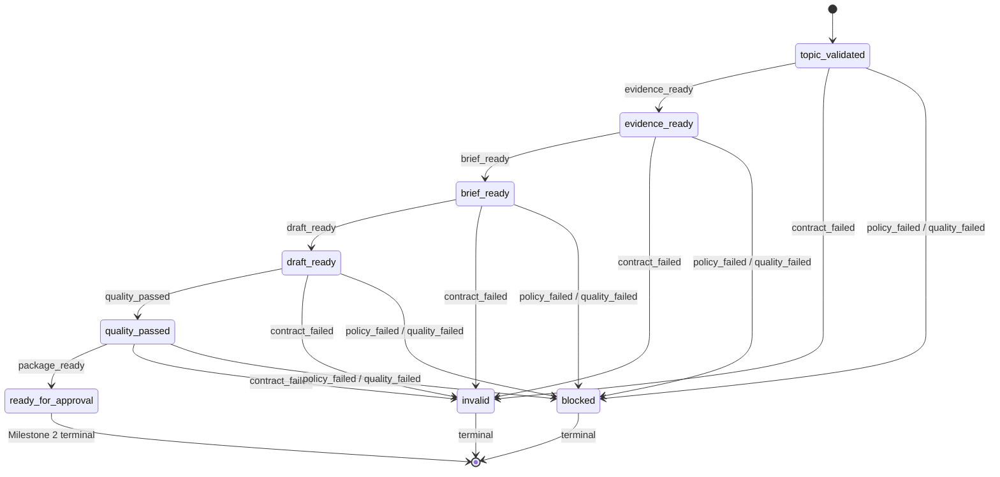
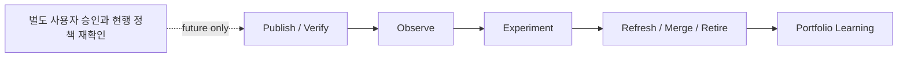

# 04. TO-BE E2E 프로세스

## Milestone 2 실행 흐름

아래 상태도만 Milestone 2에서 실행 가능하다. `ready_for_approval`, `blocked`, `invalid`는 모두 terminal이며, 실패한 입력을 고친 뒤에는 기존 실행을 되살리지 않고 새 버전으로 처음부터 평가한다.

## 향후 운영 lifecycle — 비실행 개념도

이 그림은 장기 목표의 책임과 순서만 설명하며 현재 state machine의 상태나 전이가 아니다. 특히 `ready_for_approval`에서 게시로 이어지는 실행 경로는 구현되어 있지 않다.

## 블록 계약

| TO-BE | 입력 → 출력 | 책임 | 자동화 | 초기 SLA | 오류·재시도 | stop condition |
|---|---|---|---|---|---|---|
| TOBE-001 Signal Intake | 신호·owner 범위 → TopicCandidate | Owner/Planner | assisted | 계측 후 설정 | schema 오류 0회 재시도 | owner 사실 미확정 |
| TOBE-002 Opportunity | candidate·portfolio → ContentOpportunity | Planner+Owner | assisted | 계측 후 설정 | 데이터 unknown 보존 | 중복/잠식 결정 없음 |
| TOBE-003 Evidence | opportunity → SourceEvidence·Claim | Research+QA | assisted | 최신성 정책별 | 네트워크는 향후 제한 재시도 | 핵심 출처 부족/충돌 미처리 |
| TOBE-004 Brief/Draft | evidence → brief·draft | Writer+Owner | assisted | 비용 상한 후 | 구조 오류 제한 재생성 | 허위 경험·미연결 주장 |
| TOBE-005 Quality | draft·ledger → QualityReport | QA+Owner | hybrid | 즉시 결정론 검사 | 수정 후 새 버전 평가 | 사실/정책/권리 게이트 fail |
| TOBE-006 Media | 승인 draft·asset → media manifest | Media+QA | assisted | 계측 후 | 실패 자산 제외 후 재검토 | 라이선스/alt 없음 |
| TOBE-007 SEO/Links | draft·inventory → link plan | SEO+Owner | assisted | 계측 후 | inventory 갱신 후 1회 | 잠식 전략 없음 |
| TOBE-008 Package | 승인 산출물 → offline bundle | Renderer | automated local | 로컬 1분 목표(가설) | 원자적 staging 폐기 후 재시도 | external write 시도 |
| TOBE-009 Preview Gate | bundle → preview report | QA+Owner | hybrid | 게시 전 | 수정 시 새 hash | 렌더·링크·접근성 실패 |
| TOBE-010 Publish | 승인 manifest → verified URL | Owner/future adapter | manual initially | 미정 | 로그인 만료 시 즉시 중단 | 명시 승인·지원 경로 없음 |
| TOBE-011 Observe | URL·authorized data → PostMetrics | Analytics+Owner | blocked | 접근 승인 후 | 부분·지연을 오류와 구분 | 무승인 private data 요청 |
| TOBE-012 Learn | metrics·policy → proposal | Owner+Controller | recommendation | 관찰창 후 | canary 실패 시 rollback | 합격선/권한/비용 변경 |

## 예외 경로

- 출처 부족: 주장을 축소하거나 `blocked/CLAIM_EVIDENCE_REQUIRED`로 끝낸다. 출처를 생성하지 않는다.
- 중복 주제: update, merge, differentiate 중 하나를 사람이 선택할 때까지 멈춘다.
- 품질 미달: 게시 패키지를 생성하지 않고 quality report만 남긴다.
- 로그인 만료/게시 실패: 자동 로그인이나 CAPTCHA/MFA 우회를 하지 않고 incident를 기록한다.
- 정책 변경: 정책 evidence가 만료되면 자동화 수준을 낮추고 재확인 전 게시를 막는다.
- 성과 급락: 원인을 단정하지 않고 데이터 품질, 색인, 정책, 계절성 가설을 분리한다.

## 게시 모드 승격과 강등

`approval_required`에서 제한 자동화로의 승격은 사용자 명시 승인, 현행 약관 재확인, 저위험 주제 allowlist, draft 우선, E2E·rollback rehearsal, kill switch, 표본 인간 감사, 비용·빈도 상한을 모두 요구한다. 정책 경고, 중복 게시, 사후 검증 실패, 비밀/개인정보 노출, 품질·오류 기준 초과가 한 번이라도 발생하면 즉시 `approval_required` 또는 offline-only로 강등한다. 삭제, 대량 수정, 광고·결제 변경은 승격 후에도 별도 승인 대상이다.

ASIS-001..ASIS-012는 각각 TOBE-001..TOBE-012로 한 번만 이어지며 상세 전환은 [03 ERASK+C](03_erask_transition.md)와 machine catalog에 고정한다.
